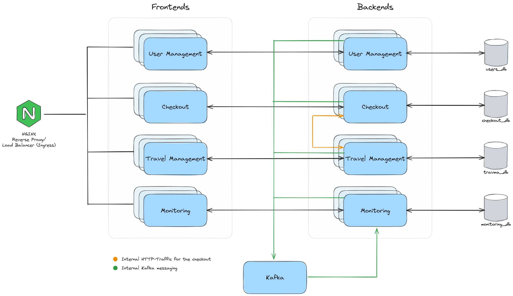

# Travelplatform CASE-M2
Project for the lecture Cloud Native Development.
As the name suggests it is a travel management platform for creating hotels, travels and book them. Everything packed with a usermanagement!


## Overview
### User Management
This hexagonal service takes care of login, register, user operations (create, read, update, delete) as well as JWT operations.

**Technology Stack:**  
Frontend: VueJS3 + Typescript + Vite + TailwindCSS + DaisyUI  
Backend: Go + Gin + GORM

Author: Dario Köllner

### Travel Management
The travel management is a hexagonal service, which has CRUD operations for hotels and corresponding travels. Each hotel can have several travels.
They can be stored inside a cart provided by the checkout service.  

**Technology Stack:**  
Frontend: Angular + Typescript  
Backend: Go + Gin + GORM

Author: Michael Gürtner

### Checkout
The checkout service has, depending on the user, all cart information is capable of storing, creating and deleting it.  
The payment process is mocked.

**Technology Stack:**  
Frontend: Angular + Typescript + TailwindCSS + DaisyUI  
Backend: Rust + Actix Web + Diesel

Author: Dario Köllner

### Monitoring
This service receives logs provided from the services mentioned above and displays them.

**Technology Stack:**  
Frontend: Angular + Typescript  
Backend: Rust + Diesel

Author: Michael Gürtner

## Project Structure
Every service is seperated in frontend and backend directories. Each microservice has its own documentation as well as some docker-compose files.
Besides, there is in the root of this repository a [docker](docker) and [kubernetes](kubernetes) directory. Both dirs contain the corresponding deployments.

Each service can be run isolated - though that does not mean they will function properly.

For further information about the services have a look at the READMEs located there.

## Quick Start
#### Docker
```bash
cd docker
```

Create docker networks:
```bash
chmod +x network_management.sh && ./network_management.sh -g
```

Start all containers:
```bash
chmod +x start-container.sh && ./start-container.sh
```
Further information and instructions can be found in the [README](docker/README.md).

#### Kubernetes
TODO

#### Run in VM
Is documented for every service. 
## Default Ports when deployed
| **Service**                | **Exposed Port** | **Internal Port** |
|----------------------------|------------------|-------------------|
| Usermanagement Frontend    | 8081             | 80                |
| Usermanagement Backend     | 8082             | 8082              |
| Postgres Usermanagement    | 8092             | 5432              |
|                            |                  |                   |
| Checkout Frontend          | 8083             | 80                |
| Checkout Backend           | 8084             | 8084              |
| Postgres Checkout          | 8094             | 5432              |
|                            |                  |                   |
| Travelmanagement Frontend  | 8085             | 8085              |
| Travelmanagement Backend   | 8086             | 8086              |
| Postgres Travelmanagement  | 8096             | 5432              |
|                            |                  |                   |
| Monitoring Frontend        | 8087             | 8087              |
| Monitoring Backend         | 8088             | 8088              |
| Postgres Monitoring        | 8098             | 5432              |


## Project Insights 
TODO: cloc